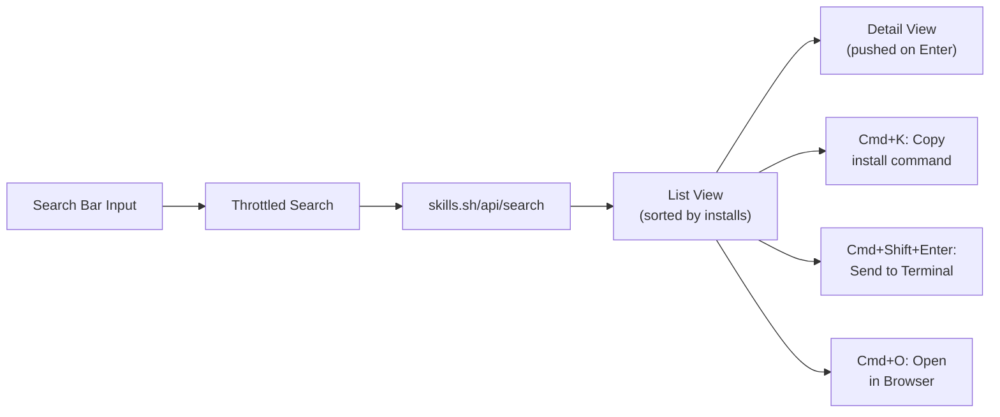

# Skill Search Raycast Extension

## Architecture

The extension already has a scaffolded Raycast project at `[package.json](package.json)` with `@raycast/api` and `@raycast/utils` installed. We will rewrite `[src/skill-search.tsx](src/skill-search.tsx)` to implement the full functionality.

## API Integration

- **Endpoint**: `https://skills.sh/api/search?q={query}&limit={limit}`
- **Response shape**: `{ skills: [{ id, skillId, name, installs, source }] }`
- Use `useFetch` from `@raycast/utils` with `keepPreviousData: true` to avoid flickering, and `execute: false` when query is empty
- Disable Raycast's built-in filtering (`filtering={false}`) since search is server-side
- Throttle search text changes (`throttle={true}`)

## UI Design

### List View (main screen)

- Each `List.Item` displays:
  - **title**: skill name (e.g., `remotion-best-practices`)
  - **subtitle**: source repo (e.g., `remotion-dev/skills`)
  - **accessories**: install count formatted with `K` suffix (e.g., `69.1K`)
- `List.EmptyView` with a prompt like "Search for agent skills" when no query

### Detail View (pushed on Enter)

- `Detail` component with markdown showing:
  - Skill name as heading
  - Install command in a code block
  - Link to skills.sh page
- `Detail.Metadata` sidebar with:
  - `Label`: Install count
  - `Link`: Repository on GitHub (`https://github.com/{source}`)
  - `Link`: View on skills.sh (`https://skills.sh/{id}`)
  - `Label`: Install command (copyable)

### Actions

On the **List View**:

- **Enter** (default): Push to Detail view
- **Cmd+K**: `Action.CopyToClipboard` -- copies `npx skills add {source} --skill {skillName}`
- **Cmd+Shift+Enter**: Custom action to send command to the default macOS Terminal via AppleScript (`osascript -e 'tell application "Terminal" to do script "..."'`)
- **Cmd+O**: `Action.OpenInBrowser` -- opens `https://skills.sh/{id}`

On the **Detail View**:

- **Enter** (default): `Action.CopyToClipboard` -- copies install command
- **Cmd+Shift+Enter**: Send to Terminal (same as list)
- **Cmd+O**: Open in browser

## File Changes

### `[src/skill-search.tsx](src/skill-search.tsx)` -- Complete rewrite

- Define `Skill` interface matching API response
- `formatInstalls(n)` helper to format numbers (e.g., `98186` -> `98.2K`)
- `getInstallCommand(skill)` helper returning `npx skills add {source} --skill {name}`
- `Command` component: `List` with `useFetch`, throttled `onSearchTextChange`
- `SkillDetail` component: `Detail` with metadata, pushed from list items
- `SkillActions` component: shared `ActionPanel` used in both List and Detail views
- `runInTerminal(command)` helper using `child_process.exec` with AppleScript to open Terminal and run the command

